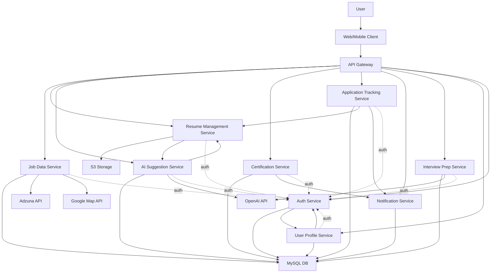

# Technical Design Document (TDD)

## 1. Technology Stack Selection

Based on project requirements and your preferences, the following technology stack is selected:

- **Frontend:** React.js  
- **Backend:** Django (Python, full-featured, powerful ORM, suitable for rapid development and robust microservices)  
- **Backend runtime:** Lambda (serverless deployment for backend services; enables automatic scaling, pay-per-use billing, and simplified infrastructure management. Each microservice or API endpoint can be deployed as an independent Lambda function, integrated with API Gateway for HTTP access. This approach reduces operational overhead and is well-suited for event-driven or microservice architectures.)
- **Database:** MySQL (for all structured data, including users, jobs, applications, certifications, interviews, etc.)  
- **File/Object Storage:** AWS S3 (for all resume files and version history, only metadata stored in MySQL)  
- **Map/Geo Service:** Google Maps API (for geolocation display and geocoding)  
- **AI Service:** OpenAI API (for AI-powered suggestions, interview preparation, etc.)  
- **Job Data API:** Adzuna (the only job data aggregation source for now, extensible in the future)  
- **CI/CD:** GitHub Actions (for automated testing, building, and deployment)
- **CD Environment & Infrastructure:** Provisioned and managed using Terraform
- **API Debugging & Testing:** Performed using Postman

---

## 2. Architecture Design

The system adopts a frontend-backend separation and an API Gateway + microservices architecture. The boundaries of each microservice, external dependencies, and database types are as follows:

- All APIs are uniformly prefixed with `/api/v1/` and routed to each microservice by the API Gateway.
- Authentication is handled by the Auth Service and enforced at the API Gateway.
- All resume files and version history are stored in S3, with only metadata in MySQL.
- Only Adzuna (job data), Google Maps (geolocation), and OpenAI (AI suggestions/interview) are integrated. There is no MongoDB, Canada Job Bank, LinkedIn, Indeed, etc.

For detailed microservice responsibilities, API endpoints, database schema, and S3 path conventions, please refer to the "Detailed Microservices Architecture design.md".

---

## 3. Environment Setup

- Use Docker for consistent development, testing, and production environments.
- Use GitHub Actions for CI/CD automation.
- All services support containerized deployment, making it easy to switch between local and cloud environments.

---

If you need further details for each microservice (API, DB schema, etc.), just let me know!