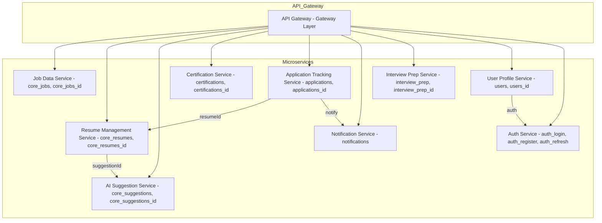

# API Architecture Diagram

This diagram illustrates the main API endpoints exposed by each microservice in JobQuest Navigator, and their relationships. Core services are highlighted.

---

**API Design Notes:**
- All client requests go through the API Gateway, which routes to the appropriate microservice.
- Each microservice exposes RESTful endpoints for its domain.
- Inter-service communication is handled via internal APIs or message queues.
- Core services' endpoints are prefixed with `/core/` for clarity.
- Authentication and authorization are managed by the Auth Service.

> This architecture ensures clear separation of concerns, scalability, and maintainability for the platform's APIs. 