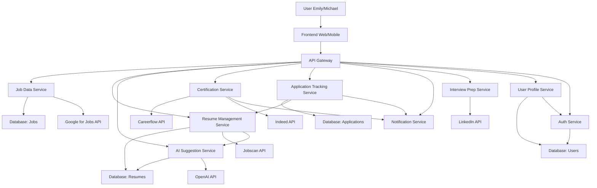

# Data Flow Diagram

This diagram illustrates the main data flows in JobQuest Navigator, from user actions to backend microservices and external APIs.

---

**Data Flow Notes:**
- User actions are sent from the frontend to the API Gateway, which routes requests to the appropriate microservice.
- Each microservice reads/writes to its own database or shared databases as needed.
- Microservices may call external APIs to fetch or process data.
- Inter-service data flows (e.g., Application Tracking Service querying Resume Management Service) are shown for key business processes.

---

## Main Data Flows and Data Contents

| From | To | Data Contents |
|------|----|---------------|
| User | Frontend | User input (login info, job search, resume upload, application actions, etc.) |
| Frontend | API Gateway | API requests (RESTful JSON: user actions, queries, submissions) |
| API Gateway | Job Data Service | Job search/filter params, job CRUD requests |
| API Gateway | Resume Management Service | Resume upload, edit, fetch, versioning requests |
| API Gateway | AI Suggestion Service | Resume/job description for AI analysis, feedback |
| API Gateway | Certification Service | Skill gap queries, certification roadmap requests |
| API Gateway | Application Tracking Service | Application create/update, status queries |
| API Gateway | Notification Service | Notification subscription, read status |
| API Gateway | Interview Prep Service | Company/job info for interview prep |
| API Gateway | User Profile Service | Profile CRUD, settings, preferences |
| API Gateway | Auth Service | Login, register, token refresh |
| Job Data Service | Database: Jobs | Job postings, metadata, search index |
| Resume Management Service | Database: Resumes | Resume files, versions, metadata |
| Application Tracking Service | Database: Applications | Application records, statuses |
| User Profile/Auth Service | Database: Users | User info, credentials, settings |
| Job Data Service | Google for Jobs API | Job search queries, location, filters |
| Resume Management Service | Jobscan API | Resume template fetch, analysis requests |
| AI Suggestion Service | OpenAI API | Resume/job text for AI suggestions |
| Certification Service | Careerflow/Indeed API | Skill/certification queries |
| Interview Prep Service | LinkedIn API | Company/job info queries |
| Application Tracking Service | Resume Management Service | ResumeId for application linkage |
| Resume Management Service | AI Suggestion Service | ResumeId/content for suggestions |
| Application Tracking/Certification Service | Notification Service | Notification triggers (status change, new cert, etc.) |
| User Profile Service | Auth Service | UserId/token for authentication |

> This table clarifies what data is exchanged in each main flow, supporting traceability and data governance.
