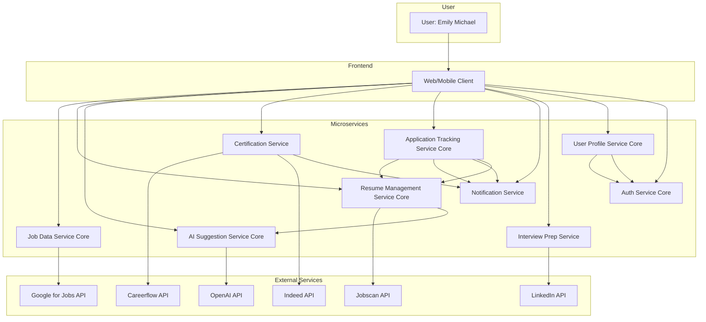

# Microservices Architecture Diagram

This diagram shows the microservices required to support the business architecture of JobQuest Navigator. Core services are marked with **[Core]**.

---

**Core Microservices:**
- **Job Data Service**: Handles job data aggregation and search.
- **Resume Management Service**: Manages resume versions and storage.
- **AI Suggestion Service**: Provides AI-driven resume and job suggestions.
- **Application Tracking Service**: Tracks job applications and statuses.
- **User Profile Service**: Manages user accounts and profiles.
- **Auth Service**: Handles authentication and authorization.

**Supporting Microservices:**
- **Certification Service**: Manages certification roadmap and recommendations.
- **Notification Service**: Sends alerts and updates to users.
- **Interview Prep Service**: Provides company research and interview preparation tools.

> Core services are essential for the platform's main value proposition and user flows. Supporting services enhance user experience and platform functionality. 