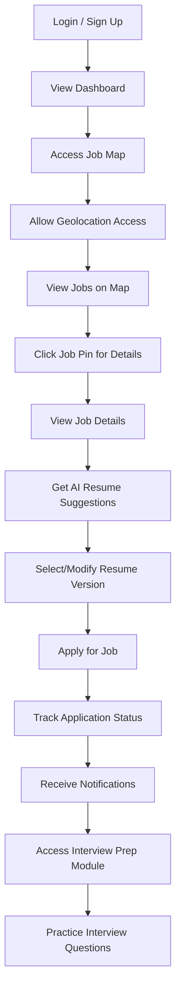
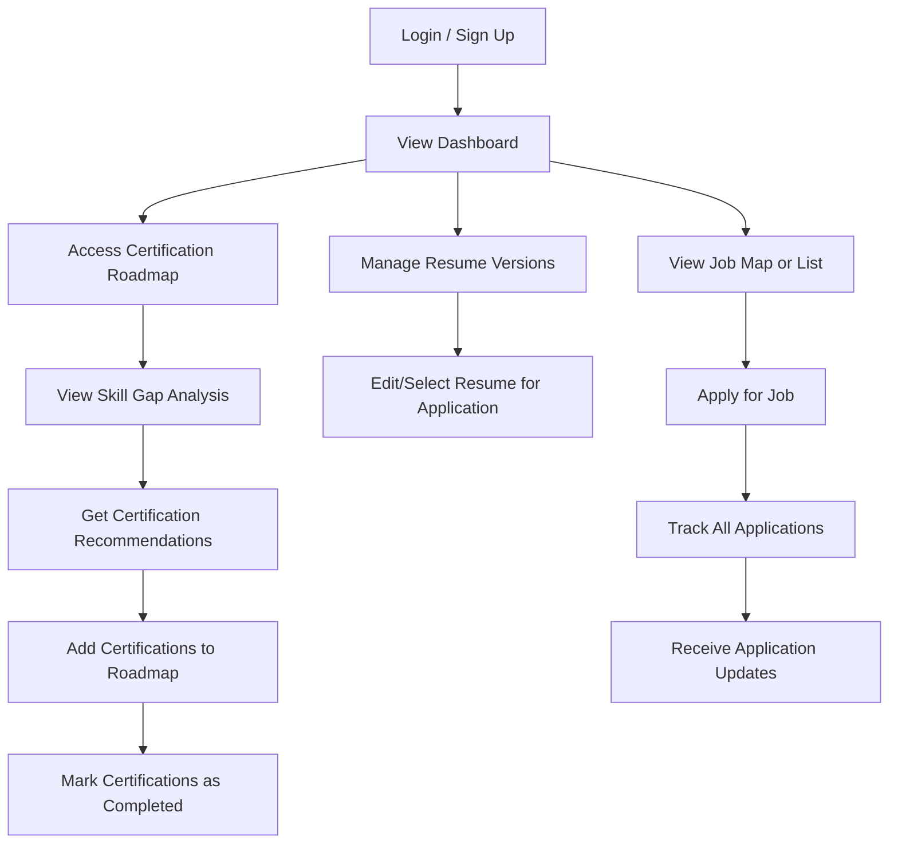

# User Flow Design

This document illustrates the main user flows for JobQuest Navigator, based on the user stories and personas (Emily and Michael) described in the PRD.

## 1. Emily: Recent Graduate – Job Discovery and Application Flow

### Description
Emily wants to find her first job in a new city, discover nearby opportunities, tailor her resume, and apply efficiently.

### Key Steps
- User logs in or signs up.
- Navigates to the dashboard and accesses the job map.
- Grants geolocation permission to see nearby jobs.
- Clicks on job pins to view details.
- Uses AI to get resume suggestions and selects the best version.
- Applies for the job and tracks application status.
- Receives notifications and prepares for interviews.

---

## 2. Michael: Mid-career Professional – Certification and Application Management Flow

### Description
Michael wants to upskill, manage multiple job applications, and track certifications.

### Key Steps
- User logs in or signs up.
- Views dashboard and accesses the certification roadmap.
- Reviews skill gap analysis and receives certification recommendations.
- Adds certifications to the roadmap and marks them as completed.
- Manages multiple resume versions for different applications.
- Applies for jobs and tracks all applications.
- Receives updates and notifications.

---

## Notes
- All flows assume the user can navigate back to the dashboard at any time.
- Error handling, onboarding, and help/support flows are not shown but should be considered in UI design.
