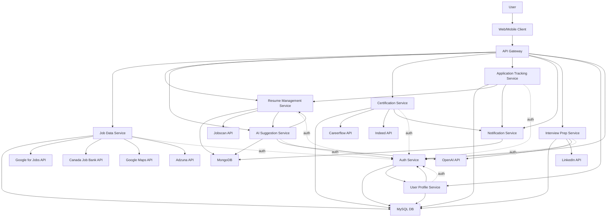

Okay, this is a great foundation! Let's flesh out the architecture for JobQuest Navigator based on your documents.

Here's a detailed design:

## 1. Detailed Microservices Architecture Diagram (Mermaid)

This diagram expands slightly on your initial one by explicitly showing an API Gateway, which is standard practice for microservice architectures accessed by frontends. It also clarifies some external service connections based on the project analysis.



## 2. Microservice Responsibilities and API Endpoints

All endpoints should be prefixed with `/api/v1/`. The API Gateway will route requests like `/api/v1/jobs/*` to the Job Data Service, `/api/v1/resumes/*` to the Resume Management Service, etc. Authentication will be handled by the API Gateway in conjunction with the Auth Service (e.g., validating JWTs).

---

*   **MS1: Job Data Service [Core]**
    - **Responsibilities**: Aggregates job listings from various sources (**Adzuna API**, Google for Jobs, Canada Job Bank, **Indeed API, etc.**), stores them, provides search and filtering capabilities. **Parses and standardizes location data (e.g., city, region). Normalizes salary data (e.g., handles hourly vs. annual, currency).** Integrates with Google Maps API for geo-visualization.
    - **Primary Database**: MySQL (for structured job data)
    - **Key API Endpoints**:
      - GET /jobs: List jobs with pagination, filtering (location, keywords, etc.).
        - Query Params: q, location, radius, page, limit, source, **salaryMin (annualized), salaryMax (annualized), employmentType, isRemote**.
      - GET /jobs/{jobId}: Get details for a specific job.
      - POST /jobs/search: Advanced search, potentially for map view (e.g., bounds).
        - Body: { "latitude": X, "longitude": Y, "radius": Z, "keywords": "...", ... }
      - GET /jobs/sources: List available job sources.
    - **External Integrations**: **Adzuna API**, Google for Jobs API, Canada Job Bank API, **Indeed API (for job listings if applicable)**, Google Maps API.

---

**MS2: Resume Management Service [Core]**
*   **Responsibilities**: Manages user resumes, including versioning, storage, parsing (potentially via Jobscan), and retrieval.
*   **Primary Database**: MongoDB (for flexible resume document storage)
*   **Key API Endpoints**:
    *   `POST /users/{userId}/resumes`: Upload a new resume (creates first version).
        *   Body: `multipart/form-data` with resume file.
        *   Response: Resume metadata, ID.
    *   `GET /users/{userId}/resumes`: List all resumes for a user.
    *   `GET /users/{userId}/resumes/{resumeId}`: Get a specific resume (latest version or specific version).
        *   Query Params: `version` (optional)
    *   `PUT /users/{userId}/resumes/{resumeId}`: Update resume content (creates a new version).
        *   Body: Resume content (e.g., JSON representation or new file).
    *   `DELETE /users/{userId}/resumes/{resumeId}`: Delete a resume.
    *   `GET /users/{userId}/resumes/{resumeId}/versions`: List all versions of a resume.
    *   `POST /users/{userId}/resumes/{resumeId}/parse`: Trigger parsing/analysis of a resume (e.g., via Jobscan).
*   **External Integrations**: Jobscan API.
*   **Internal Integrations**: AI Suggestion Service (sends resume data for analysis), Application Tracking Service (provides resume details).

---

**MS3: AI Suggestion Service [Core]**
*   **Responsibilities**: Provides AI-driven suggestions for resume improvements, job matches, and potentially initial interview question ideas based on job descriptions. Manages feedback loop for suggestions.
*   **Primary Database**: MongoDB (to store suggestion data, feedback, model parameters if any)
*   **Key API Endpoints**:
    *   `POST /suggestions/resume`: Generate suggestions for a given resume.
        *   Body: `{ "resumeId": "...", "jobDescriptionText": "..." (optional) }`
    *   `POST /suggestions/job-match`: Suggest jobs based on a resume.
        *   Body: `{ "resumeId": "..." }`
    *   `GET /users/{userId}/resumes/{resumeId}/suggestions`: Get suggestions for a specific resume.
    *   `POST /suggestions/{suggestionId}/feedback`: Submit feedback on a suggestion.
        *   Body: `{ "accepted": true/false, "comment": "..." }`
*   **External Integrations**: OpenAI API.
*   **Internal Integrations**: Resume Management Service (receives resume data, sends back suggestions).

---

**MS4: Certification Service**
*   **Responsibilities**: Manages certification roadmaps, integrates with Careerflow for skill gap analysis, and Indeed for real-time certification recommendations. Notifies users of market demand changes for certifications.
*   **Primary Database**: MySQL (for structured certification data, user progress)
*   **Key API Endpoints**:
    *   `GET /certifications`: List available certifications.
        *   Query Params: `skill`, `industry`, etc.
    *   `GET /users/{userId}/certifications/roadmap`: Get personalized certification roadmap.
    *   `POST /users/{userId}/certifications/analyze-gap`: Trigger skill gap analysis.
        *   Body: `{ "resumeId": "...", "targetJobId": "..." (optional) }`
    *   `GET /certifications/recommendations`: Get current market recommendations.
        *   Query Params: `jobTitle`, `industry`.
    *   `POST /users/{userId}/certifications/{certificationId}/track`: User starts tracking/pursuing a certification.
*   **External Integrations**: Careerflow API, Indeed API.
*   **Internal Integrations**: Notification Service (for market demand alerts).

---

**MS5: Application Tracking Service [Core]**
*   **Responsibilities**: Tracks user job applications, including the resume version used, application status, and related notes.
*   **Primary Database**: MySQL (for structured application data)
*   **Key API Endpoints**:
    *   `POST /users/{userId}/applications`: Create a new job application entry.
        *   Body: `{ "jobId": "...", "resumeId": "...", "resumeVersion": "...", "status": "Applied", "notes": "..." }`
    *   `GET /users/{userId}/applications`: List all job applications for a user.
    *   `GET /users/{userId}/applications/{applicationId}`: Get details of a specific application.
    *   `PUT /users/{userId}/applications/{applicationId}`: Update an application (e.g., status, notes).
        *   Body: `{ "status": "Interview Scheduled", "notes": "..." }`
    *   `DELETE /users/{userId}/applications/{applicationId}`: Delete an application entry.
*   **Internal Integrations**: Resume Management Service (to link to specific resume versions), Notification Service (for status updates).

---

**MS6: Notification Service**
*   **Responsibilities**: Manages and sends notifications to users (in-app, email, push) for various events like application status updates, new AI suggestions, certification market demand changes.
*   **Primary Database**: MongoDB (for storing notification history, user preferences)
*   **Key API Endpoints**:
    *   `GET /users/{userId}/notifications`: Get notifications for a user.
        *   Query Params: `unreadOnly`, `page`, `limit`.
    *   `POST /users/{userId}/notifications/{notificationId}/read`: Mark a notification as read.
    *   `GET /users/{userId}/notifications/preferences`: Get user notification preferences.
    *   `PUT /users/{userId}/notifications/preferences`: Update user notification preferences.
    *   *(Internal endpoints for other services to trigger notifications, likely via message queue or direct HTTP calls)*
        *   `POST /internal/notifications/send` (protected, service-to-service)
            *   Body: `{ "userId": "...", "type": "APP_STATUS_UPDATE", "payload": {...} }`
*   **Internal Integrations**: Triggered by Application Tracking, Certification Service, AI Suggestion Service, etc.

---

**MS7: Interview Prep Service**
*   **Responsibilities**: Provides tools for interview preparation, including AI-generated company research (via LinkedIn/OpenAI), predictive interview question generation, and a space for users to store notes.
*   **Primary Database**: MySQL (for user-specific prep notes, saved company research if any)
*   **Key API Endpoints**:
    *   `GET /interview-prep/company-insights`: Get insights for a company.
        *   Query Params: `companyName` or `companyId`.
    *   `POST /interview-prep/generate-questions`: Generate potential interview questions.
        *   Body: `{ "jobId": "...", "companyName": "..." }`
    *   `GET /users/{userId}/interview-prep/notes`: Get user's interview prep notes for a job/company.
        *   Query Params: `applicationId` or `jobId`.
    *   `POST /users/{userId}/interview-prep/notes`: Save/update interview prep notes.
        *   Body: `{ "applicationId": "...", "jobId": "...", "notesContent": "..." }`
*   **External Integrations**: LinkedIn API (or other job data sources for company info), OpenAI API.

---

**MS8: User Profile Service [Core]**
*   **Responsibilities**: Manages user profiles, including personal information, preferences, settings (excluding authentication credentials).
*   **Primary Database**: MySQL (for structured user profile data)
*   **Key API Endpoints**:
    *   `GET /users/{userId}/profile`: Get user profile.
    *   `PUT /users/{userId}/profile`: Update user profile.
        *   Body: `{ "firstName": "...", "lastName": "...", "preferences": {...} }`
    *   (User creation might be linked with Auth Service registration)
*   **Internal Integrations**: Auth Service (coordinates on user identity).

---

**MS9: Auth Service [Core]**
*   **Responsibilities**: Handles user authentication (login, registration, password reset) and authorization (issuing and validating tokens like JWTs).
*   **Primary Database**: MySQL (for storing user credentials - hashed passwords, etc.)
*   **Key API Endpoints**:
    *   `POST /auth/register`: Register a new user.
        *   Body: `{ "email": "...", "password": "..." }`
    *   `POST /auth/login`: Log in a user.
        *   Body: `{ "email": "...", "password": "..." }`
        *   Response: `{ "accessToken": "...", "refreshToken": "..." }`
    *   `POST /auth/refresh-token`: Obtain a new access token using a refresh token.
        *   Body: `{ "refreshToken": "..." }`
    *   `POST /auth/logout`: Log out a user (can blacklist token if needed).
    *   `POST /auth/request-password-reset`: Request a password reset link.
        *   Body: `{ "email": "..." }`
    *   `POST /auth/reset-password`: Reset password using a token.
        *   Body: `{ "token": "...", "newPassword": "..." }`
    *   `GET /auth/validate-token` (internal or for API Gateway): Validate an access token.
*   **Internal Integrations**: User Profile Service (coordinates on user identity), API Gateway (token validation).

---

## 3. Database Schema Design

### MySQL (Relational Data)

```
-- Users (primarily for Auth Service, linked to UserProfiles)
CREATE TABLE Users (
    id VARCHAR(36) PRIMARY KEY, -- UUID
    email VARCHAR(255) UNIQUE NOT NULL,
    password_hash VARCHAR(255) NOT NULL,
    created_at TIMESTAMP DEFAULT CURRENT_TIMESTAMP,
    updated_at TIMESTAMP DEFAULT CURRENT_TIMESTAMP ON UPDATE CURRENT_TIMESTAMP,
    is_active BOOLEAN DEFAULT TRUE,
    last_login_at TIMESTAMP NULL
);

-- UserProfiles (managed by User Profile Service)
CREATE TABLE UserProfiles (
    user_id VARCHAR(36) PRIMARY KEY,
    first_name VARCHAR(100),
    last_name VARCHAR(100),
    phone_number VARCHAR(20),
    linkedin_profile_url VARCHAR(255),
    github_profile_url VARCHAR(255),
    portfolio_url VARCHAR(255),
    preferences JSON,
    created_at TIMESTAMP DEFAULT CURRENT_TIMESTAMP,
    updated_at TIMESTAMP DEFAULT CURRENT_TIMESTAMP ON UPDATE CURRENT_TIMESTAMP,
    FOREIGN KEY (user_id) REFERENCES Users(id) ON DELETE CASCADE
);

-- Jobs (managed by Job Data Service)
CREATE TABLE Jobs (
    id VARCHAR(36) PRIMARY KEY, -- UUID
    external_job_id VARCHAR(255), -- ID from source API
    source_api VARCHAR(50) NOT NULL, -- e.g., 'Adzuna', 'GoogleForJobs', 'CanadaJobBank'
    title VARCHAR(255) NOT NULL,
    company_name VARCHAR(255),
    location_text VARCHAR(255), -- Raw location string, e.g., "Royston, Barnsley"
    city VARCHAR(100),          -- Parsed city
    region VARCHAR(100),        -- Parsed region/county/state
    country_code VARCHAR(3),    -- Parsed or inferred country code (e.g., 'GBR')
    latitude DECIMAL(10, 8),    -- For geo-spatial queries
    longitude DECIMAL(11, 8),   -- For geo-spatial queries
    description TEXT,
    url VARCHAR(2048),          -- Redirect URL to the job posting
    posted_at TIMESTAMP,        -- Original posting date
    salary_original_min DECIMAL(12,2), -- Original min salary as provided by API
    salary_original_max DECIMAL(12,2), -- Original max salary as provided by API
    salary_period VARCHAR(20),         -- e.g., 'HOURLY', 'ANNUAL', 'MONTHLY'
    salary_currency VARCHAR(3),        -- e.g., 'GBP', 'USD', 'CAD'
    salary_min_annualized DECIMAL(12,2), -- Normalized min salary (e.g., annual equivalent)
    salary_max_annualized DECIMAL(12,2), -- Normalized max salary (e.g., annual equivalent)
    employment_type VARCHAR(50),       -- Full-time, Part-time, Contract, etc.
    is_remote BOOLEAN DEFAULT FALSE,
    raw_data JSON, -- Store original API response for future use or re-processing
    created_at TIMESTAMP DEFAULT CURRENT_TIMESTAMP, -- When we ingested it
    updated_at TIMESTAMP DEFAULT CURRENT_TIMESTAMP ON UPDATE CURRENT_TIMESTAMP, -- When we last updated it
    INDEX idx_jobs_source_external_id (source_api, external_job_id),
    INDEX idx_jobs_location (latitude, longitude),
    INDEX idx_jobs_posted_at (posted_at),
    INDEX idx_jobs_city_region (city, region) -- For location-based text search
);
-- Consider adding FULLTEXT indexes on title, description, company_name for better search performance

-- Applications (managed by Application Tracking Service)
CREATE TABLE Applications (
    id VARCHAR(36) PRIMARY KEY, -- UUID
    user_id VARCHAR(36) NOT NULL,
    job_id VARCHAR(36) NULL, -- Our internal job ID (can be null if job not in our DB)
    external_job_title VARCHAR(255), -- If applying to a job not in our DB
    external_company_name VARCHAR(255), -- If applying to a job not in our DB
    external_job_url VARCHAR(2048), -- If applying to a job not in our DB
    resume_id_mongodb VARCHAR(24) NOT NULL, -- ID from MongoDB Resumes collection
    resume_version_mongodb VARCHAR(24), -- Specific version ID from MongoDB Resumes collection
    status VARCHAR(50) NOT NULL, -- e.g., 'Interested', 'Applied', 'Interviewing', 'Offer', 'Rejected'
    applied_at TIMESTAMP,
    notes TEXT,
    created_at TIMESTAMP DEFAULT CURRENT_TIMESTAMP,
    updated_at TIMESTAMP DEFAULT CURRENT_TIMESTAMP ON UPDATE CURRENT_TIMESTAMP,
    FOREIGN KEY (user_id) REFERENCES Users(id) ON DELETE CASCADE,
    FOREIGN KEY (job_id) REFERENCES Jobs(id) ON DELETE SET NULL,
    INDEX idx_applications_user_status (user_id, status)
);

-- Certifications (managed by Certification Service)
CREATE TABLE Certifications (
    id VARCHAR(36) PRIMARY KEY, -- UUID
    name VARCHAR(255) NOT NULL,
    issuing_organization VARCHAR(255),
    description TEXT,
    url VARCHAR(2048),
    keywords TEXT
);

-- UserCertifications (tracks user progress/interest in certifications)
CREATE TABLE UserCertifications (
    id VARCHAR(36) PRIMARY KEY, -- UUID
    user_id VARCHAR(36) NOT NULL,
    certification_id VARCHAR(36) NOT NULL,
    status VARCHAR(50), -- e.g., 'Planning', 'In Progress', 'Completed'
    target_completion_date DATE,
    notes TEXT,
    created_at TIMESTAMP DEFAULT CURRENT_TIMESTAMP,
    updated_at TIMESTAMP DEFAULT CURRENT_TIMESTAMP ON UPDATE CURRENT_TIMESTAMP,
    FOREIGN KEY (user_id) REFERENCES Users(id) ON DELETE CASCADE,
    FOREIGN KEY (certification_id) REFERENCES Certifications(id) ON DELETE CASCADE,
    UNIQUE (user_id, certification_id)
);

-- InterviewPrepNotes (managed by Interview Prep Service)
CREATE TABLE InterviewPrepNotes (
    id VARCHAR(36) PRIMARY KEY, -- UUID
    user_id VARCHAR(36) NOT NULL,
    application_id VARCHAR(36) NULL, -- Link to a specific application
    job_title VARCHAR(255), -- In case it's general prep
    company_name VARCHAR(255), -- In case it's general prep
    notes_content TEXT,
    created_at TIMESTAMP DEFAULT CURRENT_TIMESTAMP,
    updated_at TIMESTAMP DEFAULT CURRENT_TIMESTAMP ON UPDATE CURRENT_TIMESTAMP,
    FOREIGN KEY (user_id) REFERENCES Users(id) ON DELETE CASCADE,
    FOREIGN KEY (application_id) REFERENCES Applications(id) ON DELETE SET NULL
);
```


### MongoDB (Non-Relational/Semi-Structured Data)

**Collection: `resumes` (managed by Resume Management Service)**
```json
{
  "_id": ObjectId("60d5f1f772a9f1e4a8c8e8e8"), // Auto-generated
  "userId": "uuid-user-123", // Corresponds to Users.id in MySQL
  "originalFileName": "MyResume_v2.pdf",
  "storagePath": "/path/to/resumes/user-123/uuid-resume-abc/original.pdf", // Or S3 key
  "createdAt": ISODate("2023-01-15T10:00:00Z"),
  "updatedAt": ISODate("2023-01-18T12:30:00Z"),
  "tags": ["tech", "backend", "final"],
  "versions": [
    {
      "versionId": ObjectId("60d5f1f772a9f1e4a8c8e8e9"), // Unique ID for this version
      "versionNumber": 1,
      "createdAt": ISODate("2023-01-15T10:00:00Z"),
      "parsedContent": { // From Jobscan or similar
        "text": "Full text of resume...",
        "skills": ["Python", "Django", "React"],
        "experience": [
          { "title": "Software Engineer", "company": "Tech Corp", "duration": "2 years" }
        ],
        // ... other structured data
      },
      "jobscanAnalysisId": "jobscan-xyz-123" // If applicable
    },
    {
      "versionId": ObjectId("60d5f1f772a9f1e4a8c8e8f0"),
      "versionNumber": 2,
      "createdAt": ISODate("2023-01-18T12:30:00Z"),
      "parsedContent": { /* ... updated content ... */ },
      "jobscanAnalysisId": "jobscan-abc-456"
    }
  ],
  "currentVersionId": ObjectId("60d5f1f772a9f1e4a8c8e8f0") // Points to the active version
}
// Indexes: userId, userId_tags
```

**Collection: `ai_suggestions` (managed by AI Suggestion Service)**
```json
{
  "_id": ObjectId("60d5f2a072a9f1e4a8c8e8f1"),
  "userId": "uuid-user-123",
  "resumeId": ObjectId("60d5f1f772a9f1e4a8c8e8e8"), // Refers to 'resumes' collection
  "resumeVersionId": ObjectId("60d5f1f772a9f1e4a8c8e8f0"), // Specific version suggestion is for
  "jobDescriptionContext": "Software Engineer role requiring Python, AWS...", // Optional
  "suggestionType": "RESUME_IMPROVEMENT", // or "JOB_MATCH", "INTERVIEW_QUESTION"
  "suggestions": [
    {
      "id": "sugg-1",
      "area": "Skills section", // e.g., 'Skills section', 'Experience bullet point'
      "originalText": "Proficient in Python.",
      "suggestedText": "Expert in Python with 5+ years of experience in web development.",
      "reasoning": "Strengthens claim and adds context.",
      "priority": "High"
    }
    // ... more suggestions
  ],
  "feedback": { // User feedback on this set of suggestions
    "overallRating": 4, // 1-5
    "acceptedSuggestions": ["sugg-1"],
    "rejectedSuggestions": [],
    "comments": "Very helpful!"
  },
  "createdAt": ISODate("2023-01-19T14:00:00Z")
}
// Indexes: userId, resumeId, suggestionType
```

**Collection: `notifications` (managed by Notification Service)**
```json
{
  "_id": ObjectId("60d5f3b372a9f1e4a8c8e8f2"),
  "userId": "uuid-user-123",
  "type": "APPLICATION_STATUS_UPDATE", // e.g., NEW_AI_SUGGESTION, CERT_MARKET_DEMAND
  "title": "Application Status Updated",
  "message": "Your application for 'Software Engineer at Tech Corp' has been updated to 'Interview Scheduled'.",
  "payload": { // type-specific data
    "applicationId": "uuid-application-xyz",
    "newStatus": "Interview Scheduled"
  },
  "isRead": false,
  "createdAt": ISODate("2023-01-20T09:00:00Z"),
  "readAt": null
}
// Indexes: userId, userId_isRead, createdAt
```

## 4. Frontend Component Structure and State Management Strategy (React.js)

### A. Component Structure (High-Level):

```
src/
├── App.js                 # Main application component, routing setup
├── index.js               # Entry point
├── assets/                # Static assets (images, fonts)
├── components/            # Reusable UI components (atomic design principles)
│   ├── common/            # Very generic components (Button, Input, Modal, Card, Spinner)
│   ├── layout/            # Layout components (Header, Footer, Sidebar, PageLayout)
│   ├── auth/              # Auth related components (LoginForm, RegisterForm)
│   ├── jobs/              # Job related (JobCard, JobDetailView, JobFilters, JobMapView)
│   ├── resumes/           # Resume related (ResumeCard, ResumeEditor, ResumeVersionList)
│   ├── applications/      # Application related (ApplicationCard, ApplicationStatusTracker)
│   ├── certifications/    # Certification related (CertificationCard, RoadmapView)
│   ├── suggestions/       # AI Suggestion display (SuggestionItem, SuggestionFeedback)
│   ├── notifications/     # Notification display (NotificationBell, NotificationList)
│   └── profile/           # User profile components (ProfileForm, SettingsView)
├── constants/             # App-wide constants (API_URLS, actionTypes if not using Redux Toolkit)
├── features/              # (Alternative to pages/ or for Redux Toolkit slices)
│   ├── auth/
│   │   └── authSlice.js
│   └── jobs/
│       └── jobsSlice.js
│       └── JobSearch.js  (feature component combining smaller components)
├── hooks/                 # Custom React hooks (useAuth, useForm, useDebounce)
├── layouts/               # Main page layouts (e.g., AppLayout with header/sidebar, AuthLayout)
├── pages/                 # Top-level route components (views)
│   ├── HomePage.js
│   ├── LoginPage.js
│   ├── RegisterPage.js
│   ├── DashboardPage.js
│   ├── JobSearchPage.js       # Contains JobMapView, JobListView, Filters
│   ├── JobDetailPage.js
│   ├── ResumeManagementPage.js
│   ├── ApplicationTrackingPage.js
│   ├── CertificationRoadmapPage.js
│   ├── InterviewPrepPage.js   # For a specific application/job
│   ├── UserProfilePage.js
│   └── NotFoundPage.js
├── services/              # API call functions (e.g., jobService.js, authService.js)
├── store/                 # State management setup (e.g., Redux store)
│   ├── index.js           # Root store configuration
│   └── slices/            # Redux Toolkit slices (authSlice, userSlice, jobsSlice, etc.)
├── styles/                # Global styles, themes, CSS modules entry
└── utils/                 # Utility functions (formatters, validators)
```

### B. State Management Strategy:

1.  **Local Component State (`useState`, `useReducer`):**
    *   **Usage**: For UI state that is not shared outside a component or its direct children. Examples: form input values before submission, toggle states for modals/dropdowns within a component, temporary UI feedback.
    *   **Rationale**: Simplest, most performant for localized state. `useReducer` for more complex state logic within a component.

2.  **Global Application State (Redux Toolkit or Zustand):**
    *   **Recommendation**: **Redux Toolkit** is robust for applications of this complexity, especially with multiple interacting features. Zustand is a simpler alternative if a lighter global state manager is preferred.
    *   **Usage**: For state that needs to be accessed or modified by many components across the app.
        *   `authSlice`: User authentication status, user object (basic info like ID, email, roles), tokens.
        *   `userProfileSlice`: Detailed user profile data fetched after login.
        *   `notificationsSlice`: Unread notification count, list of recent notifications.
        *   Potentially `uiSlice`: Global loading states, theme preference, sidebar open/closed state.
    *   **Rationale**: Centralized state management makes it easier to track data flow, debug, and share data without excessive prop drilling. Redux Toolkit simplifies Redux boilerplate significantly and integrates well with TypeScript.

3.  **Server Cache / Asynchronous Data State (React Query or SWR):**
    *   **Recommendation**: **React Query** (now TanStack Query).
    *   **Usage**: For managing data fetched from APIs. This includes:
        *   Job listings and details (Job Data Service)
        *   User resumes and versions (Resume Management Service)
        *   AI suggestions (AI Suggestion Service)
        *   Certification data and roadmaps (Certification Service)
        *   Application tracking data (Application Tracking Service)
        *   Interview prep materials (Interview Prep Service)
    *   **Rationale**:
        *   Handles caching, background updates, and stale-while-revalidate logic out-of-the-box.
        *   Manages loading and error states for API requests automatically.
        *   Reduces the amount of server state that needs to be stored in Redux, simplifying Redux slices.
        *   Provides hooks like `useQuery` for fetching and `useMutation` for creating/updating/deleting data, which integrate well with React components.
        *   Optimistic updates can significantly improve perceived performance.

4.  **Context API:**
    *   **Usage**: For theming, internationalization (i18n), or simple state that needs to be shared down a specific component subtree but isn't truly global or server state.
    *   **Rationale**: Simpler than Redux for specific, less frequently changing data, avoiding prop drilling. Can be used alongside Redux Toolkit and React Query.

**Integration Strategy:**

*   **Authentication Flow**:
    1.  User logs in (Auth components -> `authService.js` -> API Gateway -> Auth Service).
    2.  On success, token and basic user info stored in `authSlice` (Redux).
    3.  `useEffect` in `App.js` or main layout listens to auth state. If authenticated, fetch detailed user profile into `userProfileSlice` using React Query (`useQuery` hooked to `userProfileService.js`).
*   **Data Fetching**:
    1.  Pages/components use React Query's `useQuery` hook to fetch data (e.g., `JobSearchPage` uses `useQuery` to get jobs from `jobService.js`).
    2.  Loading/error states are handled by React Query.
    3.  Data is cached by React Query.
*   **Data Modification**:
    1.  User actions (e.g., saving a resume, updating application status) trigger React Query's `useMutation` hook.
    2.  `useMutation` calls the relevant service function (e.g., `resumeService.updateResume`).
    3.  On success, React Query can automatically invalidate relevant `useQuery` caches to refetch fresh data, or update the cache optimistically.
    4.  If a mutation affects global state (e.g., updating user profile details might affect a `userName` displayed in the header), the `onSuccess` callback of `useMutation` can dispatch an action to update the Redux store.

This detailed design should provide a solid blueprint for developing JobQuest Navigator. Remember that this is a starting point, and you'll likely refine details as development progresses.

