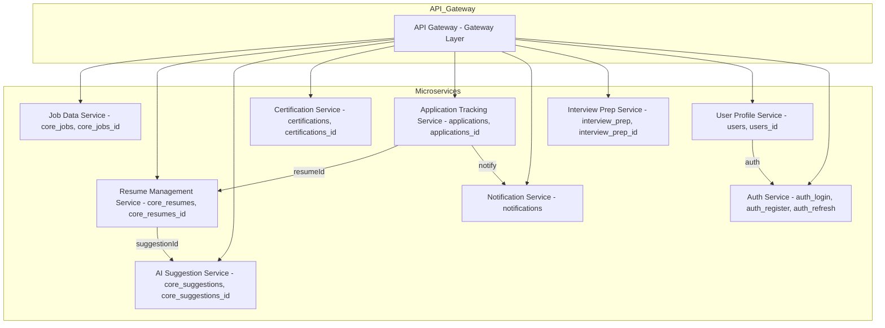

# API Architecture Diagram – JobQuest Navigator

## Overview
This document describes the API architecture for the JobQuest Navigator platform, including main endpoints, service interactions, and authentication flows.

## Main API Endpoints
- `/api/v1/jobs/` – Job search, details, application, and bookmarking
- `/api/v1/resumes/` – Resume management, versioning, export, and sharing
- `/api/v1/ai-suggestions/` – AI-powered resume suggestions and feedback
- `/api/v1/certifications/` – Certification roadmap and market demand alerts
- `/api/v1/company-research/` – Company insights and interview preparation
- `/api/v1/auth/` – User authentication and profile management

## Service Interactions
- All endpoints are served via Django REST Framework.
- AI Suggestion Service is integrated via internal API calls to OpenAI.
- Job Service integrates with Adzuna API and Google Maps for job data and geolocation.

## Authentication Flows
- JWT authentication is required for all protected endpoints.
- User roles and permissions are enforced at the API level.

## Diagram
*(See attached image for the latest API architecture diagram.)*

---
*This document is maintained in English for clarity and international collaboration.*

---

**API Design Notes:**
- All client requests go through the API Gateway, which routes to the appropriate microservice.
- Each microservice exposes RESTful endpoints for its domain.
- Inter-service communication is handled via internal APIs or message queues.
- Core services' endpoints are prefixed with `/core/` for clarity.
- Authentication and authorization are managed by the Auth Service.

> This architecture ensures clear separation of concerns, scalability, and maintainability for the platform's APIs. 