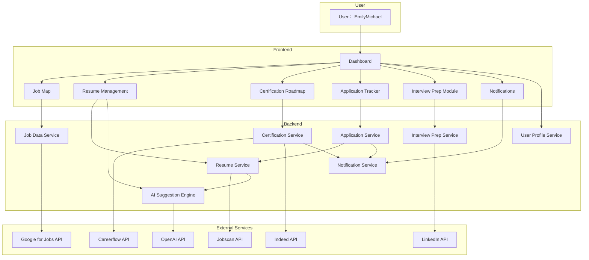

# Business Architecture Diagram

This diagram illustrates the main business modules and their relationships in JobQuest Navigator, based on the user flows for job seekers (Emily and Michael).

---

**Key Modules:**
- **Dashboard**: Central hub for navigation.
- **Job Map**: Visual job discovery.
- **Resume Management**: Versioning, editing, and AI suggestions.
- **Certification Roadmap**: Skill gap analysis and certification planning.
- **Application Tracker**: Track job applications and statuses.
- **Interview Prep Module**: Company research and interview practice.
- **Notifications**: Alerts and updates for users.

**Backend Services:**
- Each frontend module communicates with a dedicated backend service, which may integrate with external APIs for data and AI capabilities.

**External Services:**
- Third-party APIs provide job data, resume templates, skill analysis, certification info, company insights, and AI-powered features. 