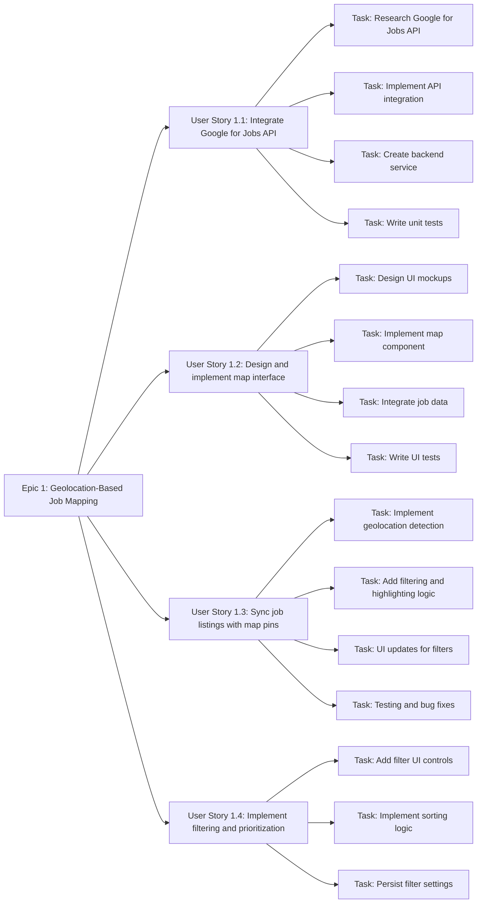
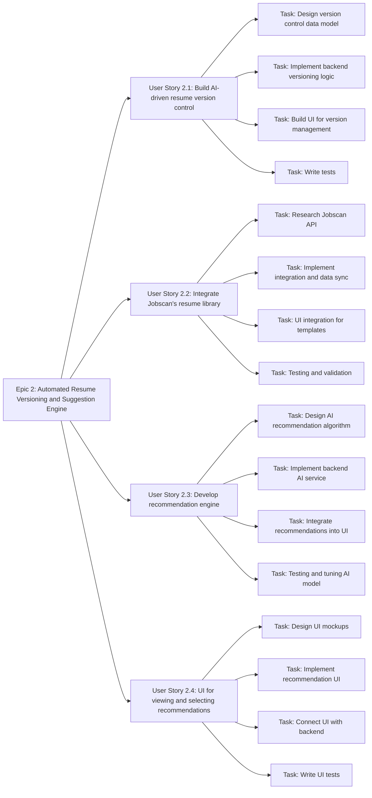
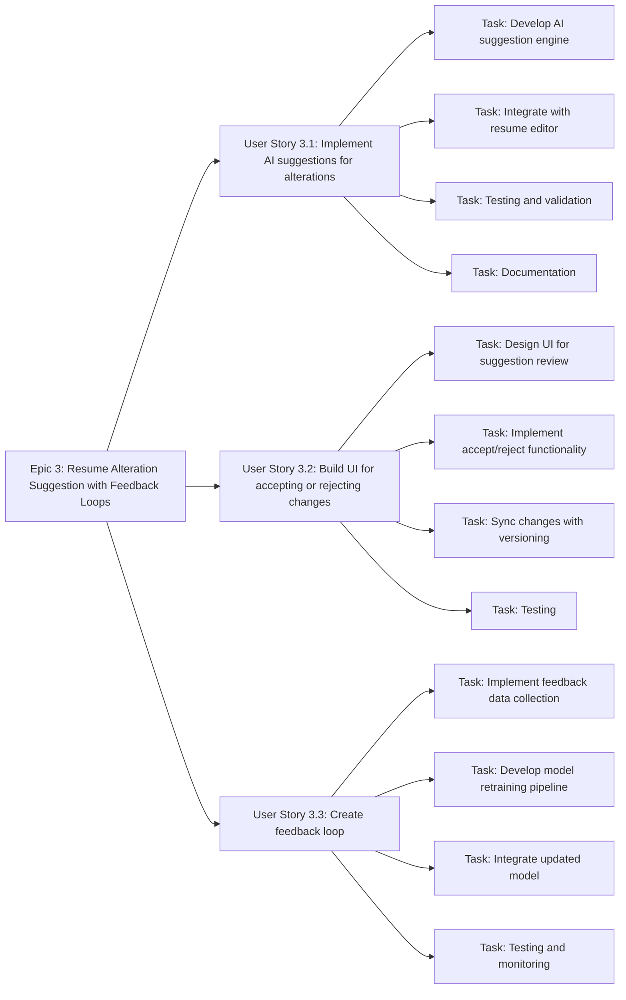
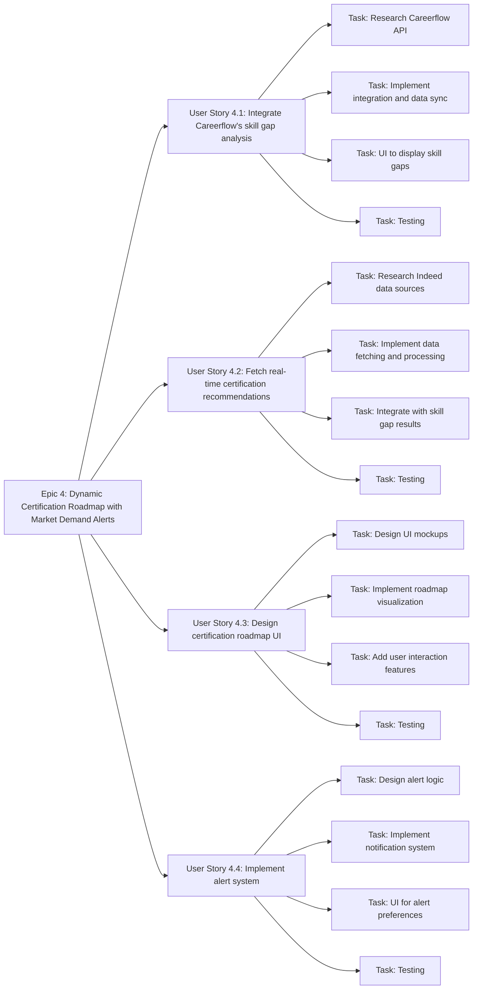
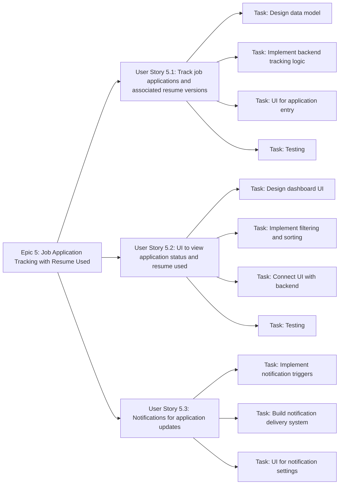
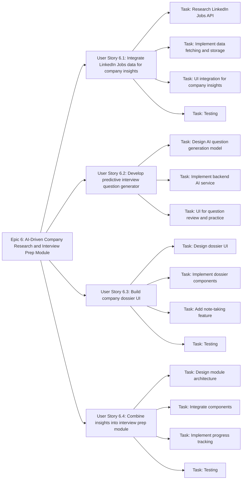

**Epic 1: Geolocation-Based Job Mapping**

**Epic 2: Automated Resume Versioning and Suggestion Engine**

**Epic 3: Resume Alteration Suggestion with Feedback Loops**

**Epic 4: Dynamic Certification Roadmap with Market Demand Alerts**

**Epic 5: Job Application Tracking with Resume Used**

**Epic 6: AI-Driven Company Research and Interview Prep Module**

