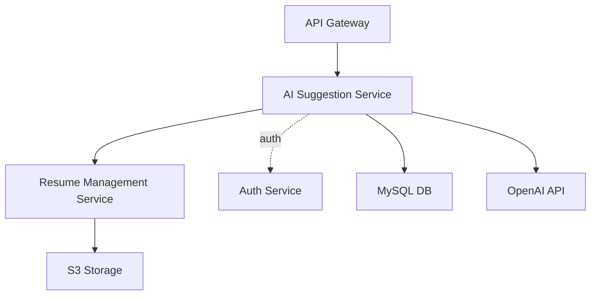

# Architecture: AI Suggestion Service (Epic 3)

This document describes the architecture of the AI Suggestion Service for JobQuest Navigator, as defined in the project’s microservices architecture.

## 1. Service Overview

The AI Suggestion Service provides:
- AI-driven resume improvement suggestions
- Job match recommendations based on resume content
- Feedback collection on suggestions
- Integration with OpenAI API for AI-powered features
- Communication with Resume Management Service and other core services

## 2. Microservice Context Diagram

## 3. Main API Endpoints

- `POST /api/v1/suggestions/resume`: Generate suggestions for a given resume
- `POST /api/v1/suggestions/job-match`: Suggest jobs based on a resume
- `GET /api/v1/users/{userId}/resumes/{resumeId}/suggestions`: Get suggestions for a specific resume
- `POST /api/v1/suggestions/{suggestionId}/feedback`: Submit feedback on a suggestion

## 4. Data Storage

- **MySQL**: Stores suggestion data, feedback, and model parameters
- **S3**: Resume files and versions (via Resume Management Service)

## 5. Technologies

- **Backend**: Django (Python)
- **Database**: MySQL
- **Object Storage**: S3 (for resumes, via Resume Management Service)
- **AI Integration**: OpenAI API

## 6. Security

- All endpoints require authentication (JWT via Auth Service)
- API Gateway handles routing and authentication

## 7. References

- See `00 Documents/0099 Final Documents/Architecture Decision/Detailed Microservices Architecture design.md` for the full system design.
