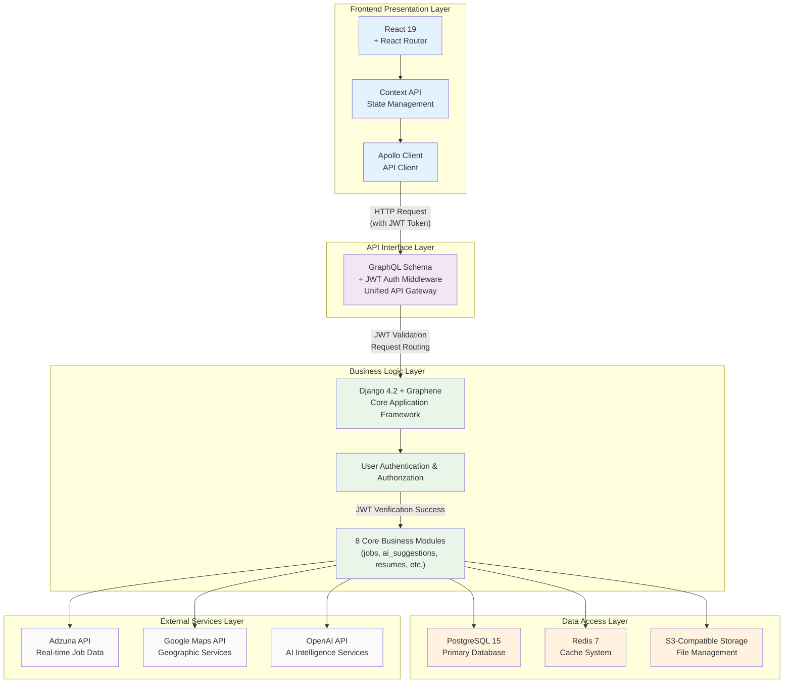
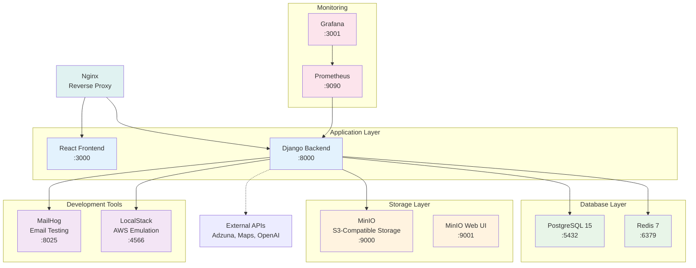
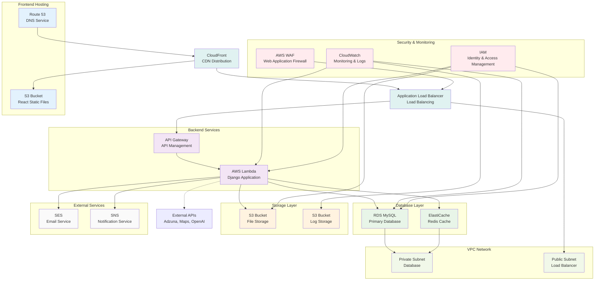

# JobQuest Navigator Project Report

## 1. Project Overview

### Basic Information
- **Project Name**: JobQuest Navigator
- **Project Type**: Full-stack job search navigation and career management platform
- **Technical Architecture**: AWS serverless-based intelligent job search assistant
- **Development Cycle**: Ongoing development

### Core Value Propositions
- **Integrated Job Search Process Management**: One-stop solution from job searching to interview preparation
- **AI-Driven Career Recommendations and Matching**: Intelligent recommendations based on user skills and preferences
- **Real-time Job Data Analysis**: Latest job information through external API integration
- **Personalized Career Development Paths**: Customized career planning recommendations for users

## 2. Project Objectives

### Primary Goals
- **Provide One-Stop Job Search Solution for Job Seekers**
  - Job searching, application tracking, resume management
  - Interview preparation, skill assessment, career planning
- **Enhance Job Search Efficiency and Matching Through AI Technology**
  - Intelligent job recommendation algorithms
  - Personalized skill improvement suggestions
- **Build Complete Career Development Ecosystem**
  - Company research and analysis tools
  - Career development path planning
- **Provide Company Research and Interview Preparation Tools**
  - Company background analysis
  - Interview question bank and practice system

### Technical Objectives
- **Cloud-Native Architecture with High Availability**: AWS Lambda-based serverless deployment
- **Microservice Modular Design**: 8 core application modules developed independently
- **Real-time Data Processing and Analysis**: External API integration and caching system
- **Mobile and Web Coverage**: Responsive design for multi-terminal adaptation

## 3. Major Technology Stack

### Backend Technologies
- **Core Framework**: Django 4.2 + Django REST Framework + GraphQL (Graphene-Django)
- **Deployment Method**: AWS Lambda + Zappa (serverless deployment)
- **Database**: 
  - Development Environment: PostgreSQL (Docker) / SQLite (local)
  - Production Environment: AWS RDS MySQL
- **Cache System**: Redis 7
- **Authentication System**: JWT Token authentication with GraphQL support
- **GraphQL Features**: Comprehensive GraphQL schema with JWT middleware
- **Data Models**: Custom User model + UUID primary keys

### Frontend Technologies
- **Core Framework**: React 19 + React Router
- **State Management**: Context API (AuthContext, JobContext)
- **API Communication**: GraphQL-first architecture - All API calls through Apollo Client
- **GraphQL Integration**: Apollo Client as the sole API communication layer with JWT authentication and caching
- **Authentication**: Fully GraphQL-based JWT authentication with token management
- **Styling System**: Responsive design with CSS modules
- **Build Tools**: Create React App with Docker containerization

### Cloud Services & Deployment
- **AWS Services**: Lambda, S3, RDS, CloudFormation, API Gateway
- **Containerization**: Docker + Docker Compose
- **Local Storage**: MinIO (S3-compatible storage)
- **AWS Simulation**: LocalStack (local development)
- **Monitoring**: Prometheus + Grafana

### External API Integration
- **Adzuna API**: Real-time job data retrieval
- **Google Maps API**: Job location visualization
- **OpenAI API**: AI recommendations and intelligent analysis
- **Others**: Email services, SMS services, etc.

### Technology Architecture Connection Diagram

## 4. System Architecture

### Architecture Features
- **Frontend-Backend Separated Microservice Architecture**
- **Serverless AWS Lambda Deployment**
- **Containerized Development Environment**
- **Multi-Environment Deployment Support** (Development/Testing/Production)

### Core Architecture Layers
1. **Frontend Presentation Layer**: React + Context API + Apollo Client
2. **API Interface Layer**: GraphQL Schema + JWT Authentication Middleware
3. **Business Logic Layer**: Django Framework + 8 Core Application Modules
4. **Data Access Layer**: PostgreSQL + Redis + S3-Compatible Storage
5. **External Services Layer**: Adzuna + Google Maps + OpenAI API Integration

### Data Model Design
- **User Model**: Extended AbstractUser model (`core/models.py:31`)
- **Job Model**: Includes location, skills, application tracking (`jobs/models.py:125`)
- **Company Model**: Enterprise information with AI research integration (`core/models.py:205`)
- **Application Model**: Job application status tracking (`jobs/models.py:189`)

### Current Docker Architecture

### AWS Production Architecture

## 5. Module Progress

### Completed Modules ✅
- **Enhanced Authentication System**
  - Complete GraphQL JWT authentication
  - GraphQL-based user management with Apollo Client
  - Custom User model with UUID primary keys
  - JWT authentication backends for GraphQL middleware
  - Token management and refresh mechanisms
  - Protected routes with authentication guards
  
- **Advanced Job Management Module**
  - Complete GraphQL job operations
  - Real-time job data integration (40+ Los Angeles programmer jobs)
  - Job search, filtering, and advanced matching
  - Job bookmarking and application tracking
  - Geographic job visualization with Google Maps API
  - Comprehensive fallback data system
  
- **Resume Builder System**
  - S3-compatible file storage (MinIO/LocalStack)
  - Resume template management and editing
  - File upload with organized user directory structure
  - PDF resume sample management
  
- **Company Research Module**
  - Enterprise information analysis and storage
  - Company background research with AI integration
  - GraphQL-based company data management
  
- **Skills Assessment System**
  - Skills management and categorization
  - User skill proficiency tracking
  - Certification management system
  - GraphQL mutations for skill operations

### In Development Modules 🔄
- **AI Recommendation System**
  - Job matching algorithms
  - Skill improvement recommendations
  - Personalized recommendation engine
  
- **Application Tracking System**
  - Full job application lifecycle management
  - Application progress visualization
  - Interview scheduling and reminders
  
- **Interview Preparation Module**
  - Interview question bank management
  - Practice system
  - Interview techniques guidance

### Core Feature Highlights
- **GraphQL-First Architecture**: All frontend API calls through Apollo Client to GraphQL
- **Complete JWT Authentication**: Unified authentication system with GraphQL middleware integration
- **Real-time Data Integration**: 40+ live programmer jobs from Los Angeles via Adzuna API
- **Geographic Visualization**: Interactive job mapping with Google Maps API integration
- **Smart Fallback System**: Comprehensive mock data ensuring full functionality during demos
- **Container-First Development**: Complete Docker environment with PostgreSQL, Redis, MinIO
- **S3-Compatible Storage**: MinIO for local development, LocalStack for AWS emulation
- **Comprehensive Security**: Multi-layer vulnerability scanning and code quality checks
- **Complete GraphQL Schema**: Unified API layer for all business operations

## 6. Deployment & Operations

### CI/CD Pipeline
- **GitHub Actions Automated Deployment**
  - Main Pipeline: `.github/workflows/ci-cd-pipeline.yml`
  - PR Checks: `.github/workflows/pr-checks.yml`
  - Security Scanning: `.github/workflows/security-comprehensive.yml`
  
- **Multi-layer Security Scanning**
  - CodeQL: Static code security analysis
  - Bandit: Python security checks
  - Trivy: Container vulnerability scanning
  - Semgrep: Application security testing
  
- **Automated Testing**
  - Unit test coverage requirements (80% backend, 70% frontend)
  - Integration test automation
  - Test environment auto-deployment and cleanup

### Environment Management
- **Development Environment**: Docker + PostgreSQL + Redis
- **Testing Environment**: Auto-deployment, 24-hour auto-cleanup
- **Production Environment**: AWS Lambda + RDS + S3

### Local Development Support
- **Complete Docker Environment**
  - Database: PostgreSQL 15 with full extensions
  - Cache: Redis 7 with persistence
  - Email Testing: MailHog for development
  - Storage: MinIO (S3-compatible) and LocalStack (AWS emulation)
  - Monitoring: Prometheus + Grafana (optional)
  - Frontend: React with Nginx reverse proxy
  - Backend: Django with complete GraphQL API

## 7. Future Vision

### Short-term Planning (1-3 months)
- **AI Recommendation Algorithm Optimization**
  - Machine learning model training
  - User behavior analysis
  - Recommendation accuracy improvement
  
- **Mobile Application Development**
  - React Native development
  - Native application features
  - Cross-platform compatibility
  
- **API Integration Expansion**
  - More job platform APIs
  - Social media integration
  - Salary data APIs
  
- **User Experience Optimization**
  - Interface design improvements
  - Performance optimization
  - Accessibility feature support

### Medium-term Planning (3-6 months)
- **Enterprise Features Development**
  - Recruiter management system
  - Resume screening tools
  - Interview scheduling system
  
- **Social Network Features**
  - Professional social platform
  - Industry expert network
  - Job search experience sharing
  
- **Advanced Data Analytics**
  - Job market analysis
  - Salary trend prediction
  - Industry development insights
  
- **Multi-language Support**
  - Internationalization framework
  - Multi-language content management
  - Localization adaptation

### Long-term Vision (6+ months)
- **Industry Vertical Expansion**
  - Industry-specific customization
  - Professional skills certification
  - Industry expert systems
  
- **Blockchain Technology Integration**
  - Decentralized identity authentication
  - On-chain skill certificates
  - Smart contract applications
  
- **Big Data Analytics Platform**
  - Real-time data processing
  - Predictive analytics models
  - Business intelligence reports
  
- **Global Deployment**
  - Multi-region server deployment
  - Local compliance requirements
  - International market expansion

## 8. Recent Improvements & Fixes

### Critical Authentication System Fixes ✅
- **JWT Authentication Backend Configuration**
  - Added missing `graphql_jwt.backends.JSONWebTokenBackend` to Django AUTHENTICATION_BACKENDS
  - Fixed GraphQL JWT middleware integration for proper token validation
  - Resolved authentication loop issues preventing user login
  
- **Frontend Authentication Service Enhancement**
  - Improved GraphQL authentication service error handling
  - Added fallback user data mechanism for robust login flow
  - Fixed infinite refresh loop in JobContext when unauthenticated
  
- **Static File Serving Resolution**
  - Fixed Nginx configuration conflicts between React and Django static files
  - Resolved frontend loading issues preventing page access
  - Optimized Docker container networking and port configuration

### Database & Development Environment ✅
- **Live Job Data Integration**
  - Successfully imported 40+ real programmer jobs from Los Angeles via Adzuna API
  - Configured proper database connections and data synchronization
  - Established test user accounts with proper authentication

- **Container Infrastructure Optimization**
  - Streamlined Docker Compose configuration for single-port frontend access
  - Enhanced Nginx reverse proxy configuration for better API routing
  - Improved static file handling and container build optimization

### Test Account Setup ✅
- **Available Test Accounts**
  - `testuser` / `password123`
  - `kevinhust` / `password123`
  - `flynn` / `password123`
- **Verified Authentication Flow**
  - GraphQL token generation working correctly
  - User authentication and authorization properly configured
  - Frontend-backend API communication established

## 9. Project Highlights

### Technical Highlights
- **Modern Serverless Architecture**
  - High availability and auto-scaling
  - Cost efficiency optimization
  - Reduced operational complexity
  
- **Complete Docker Development Environment**
  - One-click development environment startup
  - Production environment consistency
  - Multi-service integration testing
  
- **Comprehensive Security and Quality Assurance**
  - Multi-layer security scanning
  - Code quality checks
  - Automated test coverage
  
- **Flexible Data Fallback Mechanism**
  - Mock data system
  - Service degradation strategy
  - User experience guarantee

### Business Highlights
- **End-to-End Job Search Solution**
  - Complete job search process coverage
  - One-stop service platform
  - Personalized user experience
  
- **AI-Driven Intelligent Recommendations**
  - Machine learning algorithms
  - Personalized matching
  - Continuous learning optimization
  
- **Real-time Data Integration**
  - External API integration
  - Real-time data updates
  - Accuracy guarantee
  
- **Personalized User Experience**
  - User profile analysis
  - Customized interface
  - Intelligent interaction design

## 9. Project Metrics

### Technical Indicators
- **Codebase**: 8 core application modules
- **API Endpoints**: 50+ REST API interfaces
- **Data Models**: 20+ core data models
- **External Integrations**: 3 major external APIs
- **Test Coverage**: Target 80% backend, 70% frontend

### Development Progress
- **Overall Progress**: Approximately 70% complete
- **Core Features**: Basically complete
- **AI Features**: In development
- **Mobile App**: Planned

### Deployment Environments
- **Development Environment**: Docker local deployment
- **Testing Environment**: AWS automated deployment
- **Production Environment**: AWS Lambda + RDS
- **Monitoring**: Full-stack monitoring system

---

*Project is continuously updated with more features and capabilities in development...*