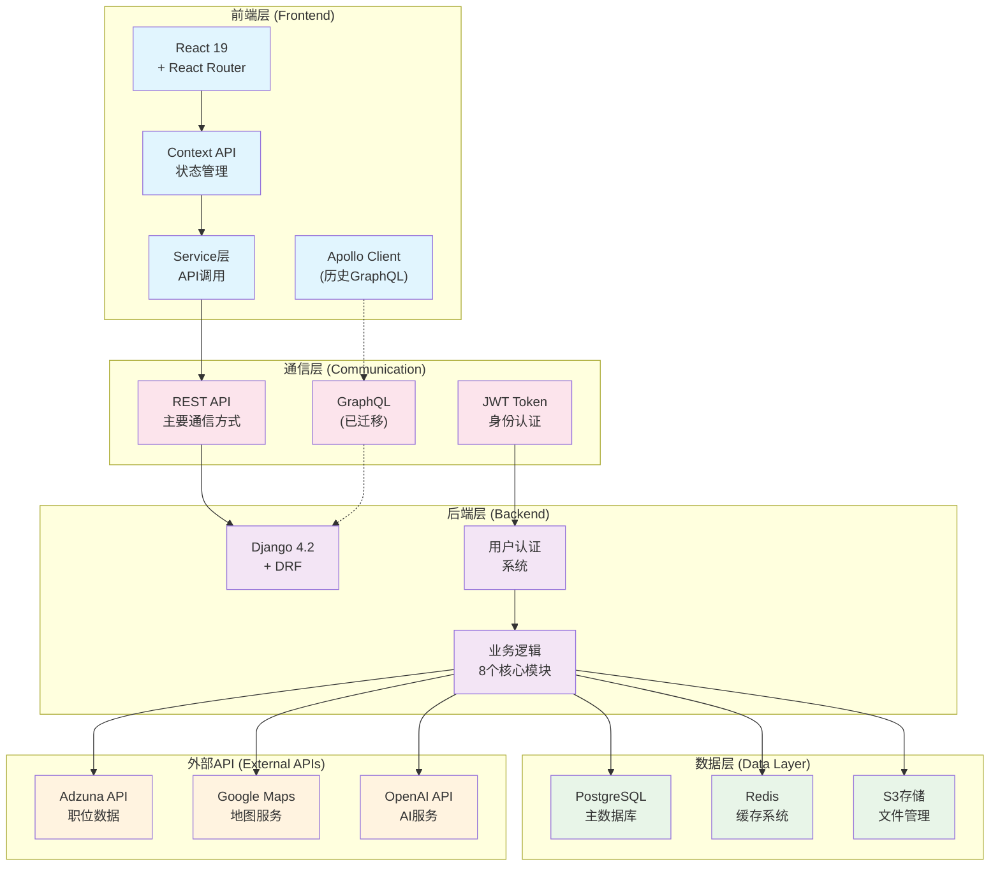
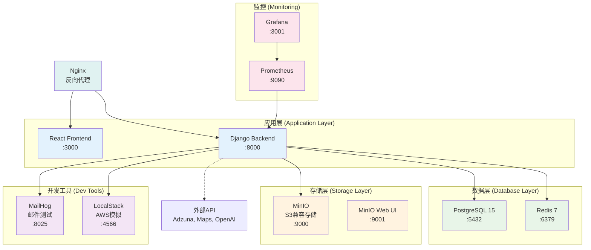
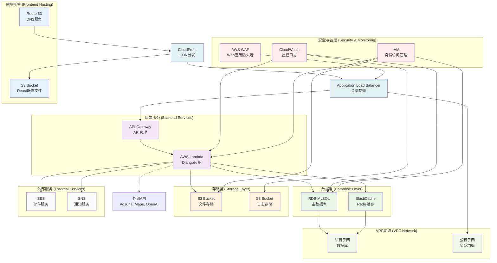

# JobQuest Navigator 项目汇报

## 1. 项目综述

### 项目基本信息
- **项目名称**: JobQuest Navigator
- **项目类型**: 全栈求职导航和职业管理平台
- **技术架构**: 基于AWS无服务器架构的智能求职助手
- **开发周期**: 持续开发中

### 核心价值主张
- **整合求职全流程管理**: 从职位搜索到面试准备的一站式解决方案
- **AI驱动的职业建议和匹配**: 基于用户技能和偏好的智能推荐
- **实时求职数据分析**: 集成外部API提供最新职位信息
- **个性化职业发展路径**: 为用户定制化职业规划建议

## 2. 项目目标

### 主要目标
- **为求职者提供一站式求职解决方案**
  - 职位搜索、申请跟踪、简历管理
  - 面试准备、技能评估、职业规划
- **通过AI技术提升求职效率和匹配度**
  - 智能职位推荐算法
  - 个性化技能提升建议
- **构建完整的职业发展生态系统**
  - 企业研究和分析工具
  - 职业发展路径规划
- **提供企业研究和面试准备工具**
  - 公司背景分析
  - 面试题库和练习系统

### 技术目标
- **云原生架构，高可用性**: 基于AWS Lambda的无服务器部署
- **微服务模块化设计**: 8个核心应用模块独立开发
- **实时数据处理和分析**: 集成外部API和缓存系统
- **移动端和Web端全覆盖**: 响应式设计适配多终端

## 3. 主要技术栈

### 后端技术
- **核心框架**: Django 4.2 + Django REST Framework
- **部署方式**: AWS Lambda + Zappa (无服务器部署)
- **数据库**: 
  - 开发环境: SQLite / PostgreSQL
  - 生产环境: AWS RDS MySQL
- **缓存系统**: Redis 7
- **认证系统**: JWT Token认证
- **数据模型**: 自定义User模型 + UUID主键

### 前端技术
- **核心框架**: React 19 + React Router
- **状态管理**: Context API (AuthContext, JobContext)
- **API通信**: REST API (从GraphQL迁移)
- **GraphQL支持**: Apollo Client (历史架构，已迁移至REST)
- **样式系统**: 响应式设计
- **构建工具**: Create React App

### 云服务与部署
- **AWS服务**: Lambda、S3、RDS、CloudFormation、API Gateway
- **容器化**: Docker + Docker Compose
- **本地存储**: MinIO (S3兼容存储)
- **AWS模拟**: LocalStack (本地开发)
- **监控**: Prometheus + Grafana

### 外部API集成
- **Adzuna API**: 实时职位数据获取
- **Google Maps API**: 职位位置可视化
- **OpenAI API**: AI建议和智能分析
- **其他**: 邮件服务、短信服务等

### 技术架构连接图

## 4. 系统架构

### 架构特点
- **前后端分离的微服务架构**
- **无服务器AWS Lambda部署**
- **容器化开发环境**
- **多环境部署支持** (开发/测试/生产)

### 核心架构层次
1. **表现层**: React前端 + Nginx反向代理
2. **API网关层**: Django REST Framework
3. **业务逻辑层**: 8个核心应用模块
4. **数据层**: 关系型数据库 + Redis缓存
5. **存储层**: S3兼容对象存储

### 数据模型设计
- **用户模型**: 扩展的AbstractUser模型 (`core/models.py:31`)
- **职位模型**: 包含位置、技能、申请跟踪 (`jobs/models.py:125`)
- **公司模型**: 企业信息与AI研究集成 (`core/models.py:205`)
- **申请模型**: 求职申请状态跟踪 (`jobs/models.py:189`)

### Docker当前架构

### AWS生产架构

## 5. 主要模块进展

### 已完成模块 ✅
- **用户认证系统**
  - JWT认证机制
  - 自定义User模型
  - 权限管理和保护路由
  
- **职位管理模块**
  - 职位搜索和筛选
  - 职位收藏和申请
  - 实时职位数据集成 (Adzuna API)
  
- **简历构建器**
  - 在线简历编辑
  - 简历模板管理
  - 文件上传和存储
  
- **公司研究模块**
  - 企业信息分析
  - 公司背景研究
  - AI驱动的公司洞察
  
- **技能评估系统**
  - 技能管理和分类
  - 认证跟踪
  - 技能评估工具

### 开发中模块 🔄
- **AI推荐系统**
  - 职位匹配算法
  - 技能提升建议
  - 个性化推荐引擎
  
- **申请跟踪系统**
  - 求职状态全流程管理
  - 申请进度可视化
  - 面试安排和提醒
  
- **面试准备模块**
  - 面试题库管理
  - 练习系统
  - 面试技巧指导

### 核心功能特色
- **实时数据集成**: 通过Adzuna API获取最新职位信息
- **地图可视化**: Google Maps API实现职位地理分布
- **智能回退机制**: 完善的Mock数据系统保证功能可用性
- **全面质量保障**: 多层安全扫描和代码质量检查

## 6. 部署与运维

### CI/CD流水线
- **GitHub Actions自动化部署**
  - 主流水线: `.github/workflows/ci-cd-pipeline.yml`
  - PR检查: `.github/workflows/pr-checks.yml`
  - 安全扫描: `.github/workflows/security-comprehensive.yml`
  
- **多层安全扫描**
  - CodeQL: 静态代码安全分析
  - Bandit: Python安全检查
  - Trivy: 容器漏洞扫描
  - Semgrep: 应用安全测试
  
- **自动化测试**
  - 单元测试覆盖率要求 (后端80%，前端70%)
  - 集成测试自动化
  - 测试环境自动部署和清理

### 环境管理
- **开发环境**: Docker + PostgreSQL + Redis
- **测试环境**: 自动部署，24小时自动清理
- **生产环境**: AWS Lambda + RDS + S3

### 本地开发支持
- **Docker服务架构**
  - 数据库: PostgreSQL 15
  - 缓存: Redis 7
  - 邮件测试: MailHog
  - 存储: MinIO / LocalStack
  - 监控: Prometheus + Grafana

## 7. 未来构想

### 短期规划 (1-3个月)
- **AI推荐算法优化**
  - 机器学习模型训练
  - 用户行为分析
  - 推荐精度提升
  
- **移动端应用开发**
  - React Native开发
  - 原生应用功能
  - 跨平台兼容性
  
- **API集成扩展**
  - 更多求职平台API
  - 社交媒体集成
  - 薪资数据API
  
- **用户体验优化**
  - 界面设计改进
  - 性能优化
  - 无障碍功能支持

### 中期规划 (3-6个月)
- **企业端功能开发**
  - 招聘方管理系统
  - 简历筛选工具
  - 面试安排系统
  
- **社交网络功能**
  - 职业社交平台
  - 行业专家网络
  - 求职经验分享
  
- **高级数据分析**
  - 求职市场分析
  - 薪资趋势预测
  - 行业发展洞察
  
- **多语言支持**
  - 国际化框架
  - 多语言内容管理
  - 本地化适配

### 长期愿景 (6个月以上)
- **行业垂直化扩展**
  - 细分行业定制化
  - 专业技能认证
  - 行业专家系统
  
- **区块链技术集成**
  - 去中心化身份认证
  - 技能证书上链
  - 智能合约应用
  
- **大数据分析平台**
  - 实时数据处理
  - 预测分析模型
  - 商业智能报表
  
- **全球化部署**
  - 多地区服务器部署
  - 本地化合规要求
  - 国际市场扩展

## 8. 项目亮点

### 技术亮点
- **现代化无服务器架构**
  - 高可用性和自动扩展
  - 成本效益优化
  - 运维复杂度降低
  
- **完整的Docker开发环境**
  - 一键启动开发环境
  - 生产环境一致性
  - 多服务集成测试
  
- **全面的安全和质量保障**
  - 多层安全扫描
  - 代码质量检查
  - 自动化测试覆盖
  
- **灵活的数据回退机制**
  - Mock数据系统
  - 服务降级策略
  - 用户体验保障

### 业务亮点
- **端到端求职解决方案**
  - 覆盖求职全流程
  - 一站式服务平台
  - 个性化用户体验
  
- **AI驱动的智能推荐**
  - 机器学习算法
  - 个性化匹配
  - 持续学习优化
  
- **实时数据集成**
  - 外部API集成
  - 实时数据更新
  - 准确性保障
  
- **个性化用户体验**
  - 用户画像分析
  - 定制化界面
  - 智能交互设计

## 9. 项目数据

### 技术指标
- **代码库**: 8个核心应用模块
- **API端点**: 50+ REST API接口
- **数据模型**: 20+ 核心数据模型
- **外部集成**: 3个主要外部API
- **测试覆盖**: 目标80%后端，70%前端

### 开发进度
- **整体进度**: 约70%完成
- **核心功能**: 基本完成
- **AI功能**: 开发中
- **移动端**: 计划中

### 部署环境
- **开发环境**: Docker本地部署
- **测试环境**: AWS自动化部署
- **生产环境**: AWS Lambda + RDS
- **监控**: 全链路监控体系

---

*项目持续更新中，更多功能和特性正在开发中...*