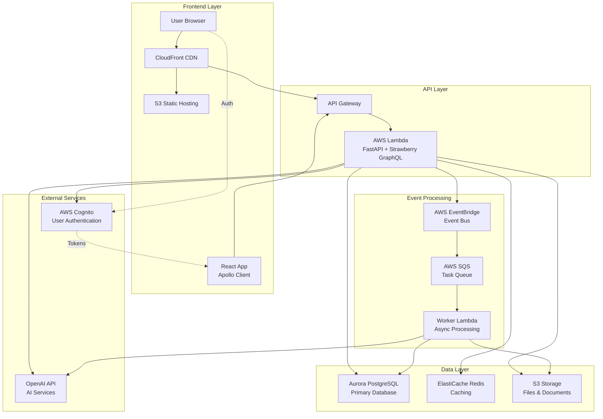

# Technical Design Document (TDD) v2.0
## JobQuest Navigator - Simplified Architecture

## 1. Executive Summary

JobQuest Navigator has been redesigned with a simplified, user-centric approach focusing on 4 core features. The architecture has been modernized to use FastAPI + Strawberry GraphQL with AWS Cognito authentication, eliminating external job APIs in favor of user-input based job management.

## 2. Technology Stack Selection

Based on the simplified requirements and modern best practices, the following technology stack is selected:

### Core Technologies
- **Backend:** FastAPI + Strawberry GraphQL (Python)
- **Authentication:** AWS Cognito User Pool (replacing JWT)
- **Database:** AWS Aurora PostgreSQL (production) / PostgreSQL (development)
- **Caching:** AWS ElastiCache Redis
- **File Storage:** AWS S3 (production) / MinIO (development)
- **Frontend:** React 19 + Apollo Client
- **State Management:** React Context API
- **Deployment:** AWS Lambda Container Images
- **Infrastructure:** AWS API Gateway, CloudFront, EventBridge

### External Services
- **AI Service:** OpenAI API (for resume optimization and company research)
- **Maps:** Removed (no more geolocation-based job discovery)
- **Job APIs:** Removed (Adzuna, Google for Jobs no longer used)

### Development Environment
- **Containerization:** Docker with PostgreSQL, Redis, MinIO
- **CI/CD:** GitHub Actions
- **Infrastructure as Code:** Terraform/AWS CDK
- **Monitoring:** AWS CloudWatch, X-Ray

## 3. Architecture Overview

The system adopts a simplified microservices architecture with GraphQL as the primary API layer. All external job discovery features have been removed in favor of user-input driven job management.



## 4. Core Features Architecture

### 4.1 User Account Management & Resume Processing
**Components:**
- AWS Cognito User Pool for authentication
- FastAPI + Strawberry GraphQL for user profile management
- S3 for resume file storage
- Async resume parsing with EventBridge triggers

**Data Flow:**
1. User registers/logs in via Cognito
2. User uploads resume to S3
3. EventBridge triggers async parsing worker
4. Parsed data stored in Aurora PostgreSQL
5. Skills and certifications managed via GraphQL

### 4.2 Position-Tailored Resume Optimization
**Components:**
- User input forms for job position details
- OpenAI API integration for AI analysis
- GraphQL mutations for resume optimization
- Version control for customized resumes

**Data Flow:**
1. User inputs job position details
2. System analyzes resume vs job description using OpenAI
3. AI generates optimization suggestions
4. User reviews and applies suggestions
5. Customized resume version created and stored

### 4.3 Skills Assessment & Learning Pathways
**Components:**
- Skills mapping and gap analysis
- IT-focused skill evaluation
- Learning certification recommendations
- Progress tracking

**Data Flow:**
1. System analyzes user skills vs job requirements
2. AI identifies skill gaps (IT-focused)
3. Personalized learning pathways generated
4. Certification recommendations provided
5. Progress tracked and updated

### 4.4 Company Research & Interview Preparation
**Components:**
- User-triggered company research
- AI-powered company insights
- Curated interview question database
- Practice and preparation tools

**Data Flow:**
1. User triggers company research for applied position
2. AI generates company insights using OpenAI
3. Interview questions curated from open-source repositories
4. Customized interview preparation materials created
5. Practice progress tracked

## 5. Database Design

### 5.1 Core Entities

```sql
-- Users (linked to Cognito)
CREATE TABLE users (
    id UUID PRIMARY KEY,
    cognito_sub VARCHAR(255) UNIQUE NOT NULL,
    email VARCHAR(254) UNIQUE NOT NULL,
    first_name VARCHAR(150),
    last_name VARCHAR(150),
    created_at TIMESTAMP DEFAULT NOW(),
    updated_at TIMESTAMP DEFAULT NOW()
);

-- User-Input Jobs (replacing external job data)
CREATE TABLE user_jobs (
    id UUID PRIMARY KEY,
    user_id UUID REFERENCES users(id),
    title VARCHAR(200) NOT NULL,
    company_name VARCHAR(200) NOT NULL,
    description TEXT,
    location_text VARCHAR(200),
    requirements TEXT,
    created_at TIMESTAMP DEFAULT NOW()
);

-- Resume Management
CREATE TABLE resumes (
    id UUID PRIMARY KEY,
    user_id UUID REFERENCES users(id),
    title VARCHAR(200),
    file_path VARCHAR(500),
    content TEXT,
    is_primary BOOLEAN DEFAULT FALSE,
    created_at TIMESTAMP DEFAULT NOW()
);

-- Resume Versions (for job-specific optimization)
CREATE TABLE resume_versions (
    id UUID PRIMARY KEY,
    original_resume_id UUID REFERENCES resumes(id),
    user_job_id UUID REFERENCES user_jobs(id),
    title VARCHAR(200),
    optimized_content TEXT,
    ai_suggestions JSONB,
    created_at TIMESTAMP DEFAULT NOW()
);

-- Skills Management
CREATE TABLE user_skills (
    id UUID PRIMARY KEY,
    user_id UUID REFERENCES users(id),
    skill_name VARCHAR(100) NOT NULL,
    skill_category VARCHAR(50),
    proficiency_level INTEGER CHECK (proficiency_level BETWEEN 1 AND 5),
    created_at TIMESTAMP DEFAULT NOW()
);

-- Certifications
CREATE TABLE user_certifications (
    id UUID PRIMARY KEY,
    user_id UUID REFERENCES users(id),
    certification_name VARCHAR(200) NOT NULL,
    issuing_organization VARCHAR(200),
    issue_date DATE,
    expiry_date DATE,
    credential_id VARCHAR(100),
    file_path VARCHAR(500),
    created_at TIMESTAMP DEFAULT NOW()
);

-- Job Applications Tracking
CREATE TABLE job_applications (
    id UUID PRIMARY KEY,
    user_id UUID REFERENCES users(id),
    user_job_id UUID REFERENCES user_jobs(id),
    resume_version_id UUID REFERENCES resume_versions(id),
    status VARCHAR(50) DEFAULT 'applied',
    applied_date DATE,
    interview_stages JSONB,
    notes TEXT,
    created_at TIMESTAMP DEFAULT NOW(),
    updated_at TIMESTAMP DEFAULT NOW()
);

-- Company Research
CREATE TABLE company_research (
    id UUID PRIMARY KEY,
    user_id UUID REFERENCES users(id),
    company_name VARCHAR(200) NOT NULL,
    research_data JSONB,
    interview_questions JSONB,
    created_at TIMESTAMP DEFAULT NOW()
);
```

## 6. API Design

### 6.1 GraphQL Schema Structure

```graphql
type Query {
  # User Profile
  currentUser: User
  
  # Jobs
  userJobs(filters: JobFilters): [UserJob!]!
  userJob(id: ID!): UserJob
  
  # Resumes
  resumes: [Resume!]!
  resume(id: ID!): Resume
  resumeVersions(resumeId: ID!): [ResumeVersion!]!
  
  # Skills & Certifications
  userSkills: [UserSkill!]!
  userCertifications: [UserCertification!]!
  
  # Applications
  jobApplications: [JobApplication!]!
  
  # Company Research
  companyResearch(companyName: String!): CompanyResearch
}

type Mutation {
  # User Management
  updateUserProfile(input: UpdateUserProfileInput!): UserProfileResponse!
  
  # Job Management
  createUserJob(input: CreateUserJobInput!): UserJobResponse!
  updateUserJob(id: ID!, input: UpdateUserJobInput!): UserJobResponse!
  deleteUserJob(id: ID!): DeleteResponse!
  
  # Resume Management
  uploadResume(input: UploadResumeInput!): ResumeResponse!
  optimizeResume(input: OptimizeResumeInput!): ResumeOptimizationResponse!
  
  # Skills & Certifications
  addSkill(input: AddSkillInput!): SkillResponse!
  addCertification(input: AddCertificationInput!): CertificationResponse!
  
  # Application Tracking
  createJobApplication(input: CreateJobApplicationInput!): JobApplicationResponse!
  updateApplicationStatus(id: ID!, status: String!): JobApplicationResponse!
  
  # Company Research
  generateCompanyResearch(input: CompanyResearchInput!): CompanyResearchResponse!
}
```

## 7. Security Considerations

### 7.1 Authentication & Authorization
- AWS Cognito User Pool for secure authentication
- JWT token validation in GraphQL resolvers
- Row-level security ensuring users only access their data
- MFA support through Cognito configuration

### 7.2 Data Protection
- All data encrypted in transit and at rest
- S3 bucket policies restricting file access
- Database connection encryption
- Sensitive data masked in logs

### 7.3 API Security
- Rate limiting at API Gateway level
- Input validation and sanitization
- SQL injection prevention with parameterized queries
- XSS protection in frontend

## 8. Performance Optimization

### 8.1 Caching Strategy
- Redis caching for frequently accessed user data
- GraphQL query result caching
- S3 CloudFront distribution for static assets
- Aurora read replicas for read-heavy operations

### 8.2 Async Processing
- EventBridge for decoupled event processing
- SQS for reliable task queuing
- Lambda workers for heavy computations
- Background processing for AI operations

## 9. Monitoring & Observability

### 9.1 Logging
- Structured logging with AWS CloudWatch
- Centralized log aggregation
- Error tracking and alerting
- Performance metrics collection

### 9.2 Tracing
- AWS X-Ray for distributed tracing
- GraphQL operation monitoring
- Database query performance tracking
- External API call monitoring

## 10. Deployment Strategy

### 10.1 Infrastructure
- Infrastructure as Code using Terraform
- Multi-environment support (dev, staging, prod)
- Blue-green deployment for zero downtime
- Automated rollback capabilities

### 10.2 CI/CD Pipeline
- GitHub Actions for automation
- Automated testing and security scanning
- Docker image building and ECR pushing
- Lambda function deployment

## 11. Migration Considerations

### 11.1 From Existing Django System
- Gradual migration using Strangler Fig pattern
- Dual GraphQL endpoints during transition
- Data migration scripts for user data
- Feature flag system for controlled rollout

### 11.2 External API Removal
- Remove all Adzuna API integrations
- Remove Google Maps dependencies
- Migrate to user-input job system
- Update frontend to remove map components

This simplified architecture focuses on the core user value proposition while reducing complexity and external dependencies, making the system more maintainable and cost-effective.