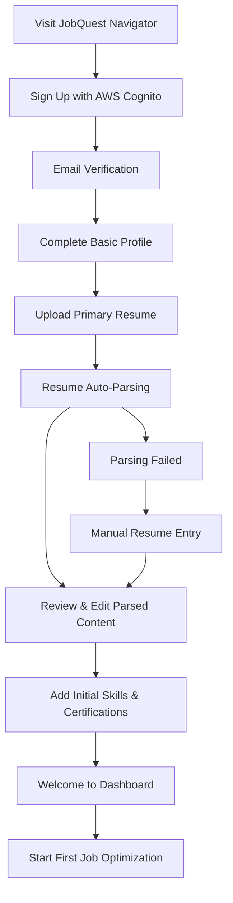
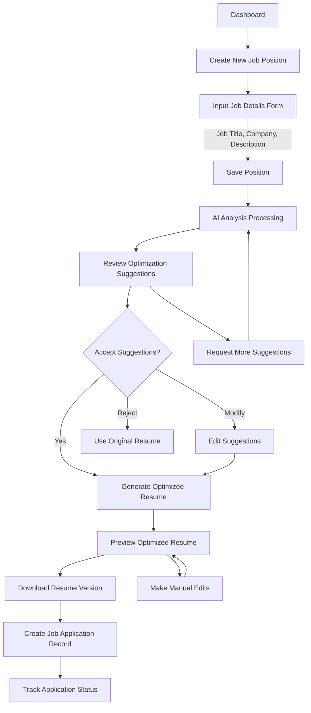
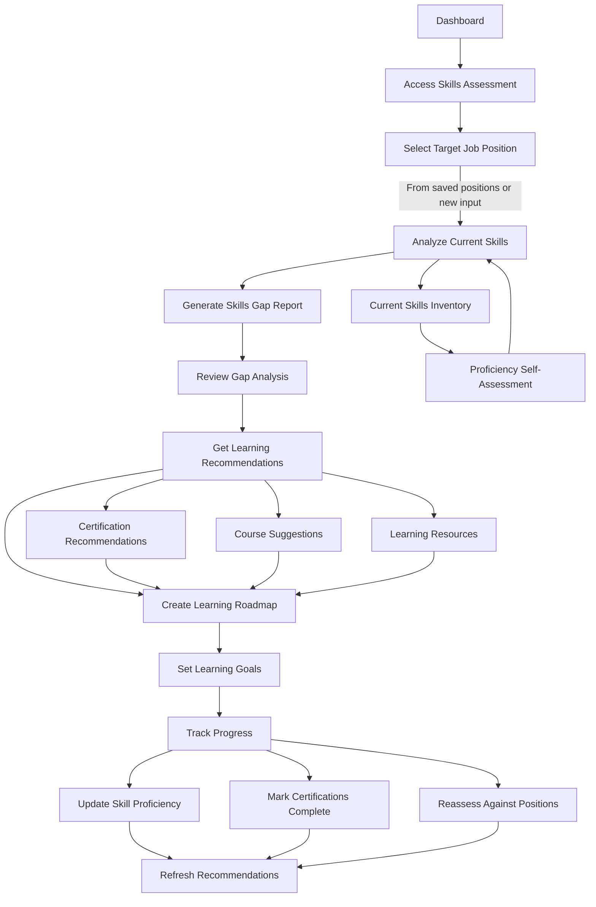
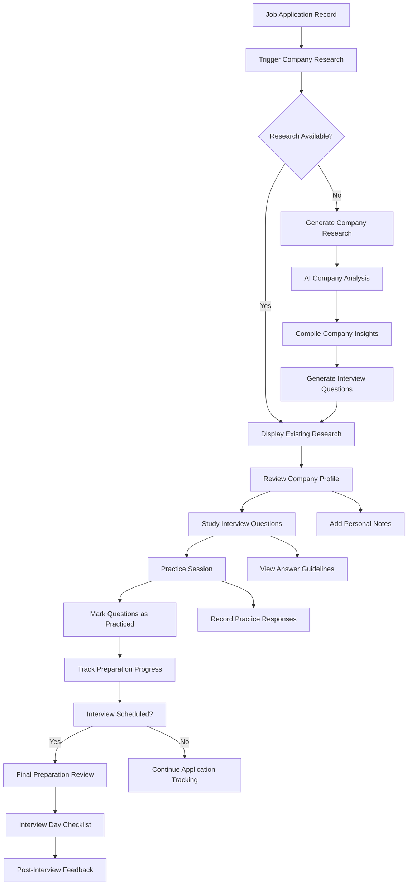
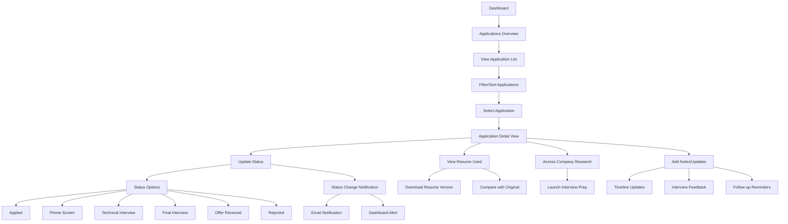

# User Flow Design v2.0
## JobQuest Navigator - Simplified User-Centric Flows

This document illustrates the main user flows for the redesigned JobQuest Navigator, focusing on the four core features: user account management, position-tailored resume optimization, skills assessment, and company research with interview preparation.

---

## 1. New User Onboarding Flow

### Description
A streamlined onboarding process that quickly gets users set up with their profile, resume, and first optimization.

### Key Onboarding Steps
1. **Registration:** AWS Cognito-powered secure sign-up with email verification
2. **Profile Setup:** Basic personal information and preferences
3. **Resume Upload:** Primary resume upload with intelligent parsing
4. **Content Review:** User validates and refines auto-extracted content
5. **Skills Inventory:** Initial skills and certifications setup
6. **First Use:** Guided introduction to job position optimization

### Success Criteria
- 90% of users complete onboarding within 10 minutes
- 85% of resumes parse successfully with user satisfaction
- 70% of users complete their first optimization within 24 hours

---

## 2. Resume Optimization Flow (Core Feature)

### Description
The primary user workflow where users input job details and receive AI-powered resume optimization suggestions.

### Detailed Steps

#### Phase 1: Job Position Input
1. **Access Feature:** From dashboard or direct navigation
2. **Job Details Form:**
   - Job title (required)
   - Company name (required) 
   - Full job description (required)
   - Location (optional, text only)
   - Additional requirements or notes
3. **Save Position:** Store for future reference and optimization

#### Phase 2: AI Analysis & Suggestions  
1. **Processing:** AI analyzes resume content against job requirements
2. **Suggestion Categories:**
   - Keywords to add or emphasize
   - Experience points to highlight
   - Skills to feature prominently
   - Content to de-emphasize or remove
   - Industry-specific language adjustments
3. **Confidence Scoring:** Each suggestion includes confidence level

#### Phase 3: User Review & Customization
1. **Suggestion Review:** Clear presentation of all recommendations
2. **User Control:** Accept, modify, or reject individual suggestions
3. **Preview Generation:** Real-time preview of optimized resume
4. **Iterative Refinement:** Request additional suggestions if needed

#### Phase 4: Application Management
1. **Resume Download:** Export optimized version in multiple formats
2. **Application Tracking:** Create tracking record linking position and resume
3. **Status Management:** Update application progress over time

### Success Criteria
- Users complete optimization in under 5 minutes
- 80% of suggestions are accepted by users
- Generated resumes score higher on ATS compatibility

---

## 3. Skills Assessment & Learning Pathway Flow

### Description
Users discover skill gaps and receive personalized learning recommendations for IT career advancement.

### Detailed Steps

#### Phase 1: Skills Inventory & Assessment
1. **Current Skills Review:** Display user's existing skills inventory
2. **Proficiency Evaluation:** Self-assessment on 1-5 scale for each skill
3. **Skills Categorization:** Technical, soft skills, domain expertise
4. **Gap Identification:** Compare against selected target position

#### Phase 2: Learning Pathway Generation  
1. **Skills Gap Analysis:** AI identifies missing or weak skills
2. **Prioritization:** Rank skills by importance for target role
3. **Learning Recommendations:**
   - Specific certifications (PMP, AWS, Google Cloud, etc.)
   - Online courses and platforms
   - Books and learning resources
   - Estimated time commitments
4. **Roadmap Creation:** Sequential learning plan with milestones

#### Phase 3: Progress Tracking & Updates
1. **Goal Setting:** Set specific learning objectives and timelines
2. **Progress Monitoring:** Track completion of courses, certifications
3. **Skills Updates:** Update proficiency levels as skills improve
4. **Reassessment:** Periodic re-evaluation against career goals

### Success Criteria
- 85% of users complete initial skills assessment
- 60% of users set at least one learning goal
- 40% of users update their skills inventory monthly

---

## 4. Company Research & Interview Preparation Flow

### Description
User-triggered company research and interview preparation for specific job applications.

### Detailed Steps

#### Phase 1: Research Trigger & Generation
1. **Access Point:** From job application tracking interface
2. **Research Generation:**
   - Company background and history
   - Recent news and developments  
   - Company culture and values
   - Interview process insights
   - Industry context and positioning
3. **Data Sources:** AI-powered research using OpenAI with web data

#### Phase 2: Interview Question Preparation
1. **Question Database:** Curated from GitHub repositories and open sources
2. **Customization:** AI filters and prioritizes based on:
   - Company type and size
   - Role requirements
   - Industry standards
   - Recent trends
3. **Question Categories:**
   - Behavioral interview questions
   - Technical questions (role-specific)
   - Company culture fit questions
   - Situational judgment scenarios

#### Phase 3: Practice & Preparation Tools
1. **Study Materials:** Organized presentation of research and questions
2. **Practice Features:**
   - Question-by-question practice mode
   - Answer framework guidance
   - Personal notes and responses
   - Progress tracking
3. **Final Preparation:** Interview day checklist and last-minute review

### Success Criteria
- Company research completed for 70% of tracked applications
- Users practice with average of 15+ questions per interview
- 80% of users report feeling more prepared after using tools

---

## 5. Application Tracking & Management Flow

### Description
Comprehensive management of job applications, resume versions, and interview progress.

### Detailed Steps

#### Phase 1: Applications Overview
1. **Dashboard Integration:** Central view of all job applications
2. **Status Summary:** Quick overview of application stages
3. **Recent Activity:** Latest updates and upcoming actions
4. **Filtering Options:** By status, company, date, position type

#### Phase 2: Individual Application Management
1. **Detailed View:** Complete application information
2. **Status Tracking:** Current stage with timeline
3. **Associated Materials:** Links to resume version and research
4. **Notes & Updates:** Personal observations and feedback

#### Phase 3: Progress Updates & Notifications  
1. **Status Updates:** Easy status change with timestamp
2. **Notification System:** Automated alerts for status changes
3. **Follow-up Reminders:** Configurable reminders for next actions
4. **Analytics:** Success rates and application patterns

### Success Criteria
- 95% of applications tracked in system
- Users update status within 24 hours of changes
- Application tracking reduces missed follow-ups by 80%

---

## 6. Cross-Feature Integration Points

### Resume Optimization ↔ Skills Assessment
- Skills gaps identified in assessment inform resume optimization suggestions
- Resume optimization reveals skill development opportunities
- Updated skills automatically improve future resume suggestions

### Application Tracking ↔ Company Research  
- New applications automatically suggest company research
- Research status visible in application tracking interface
- Interview preparation integrated with application timeline

### Skills Assessment ↔ Interview Preparation
- Technical interview questions prioritized based on skill proficiency
- Interview preparation identifies additional skill development needs
- Learning progress supports more confident interview performance

### All Features ↔ Dashboard
- Unified dashboard showing progress across all features
- Quick actions available for each feature from central location
- Notifications and reminders integrated across all workflows

---

## 7. Error Handling & Edge Cases

### Common Error Scenarios
1. **Resume Parsing Failures:** Fallback to manual entry with guided prompts
2. **AI Service Unavailable:** Graceful degradation with cached suggestions
3. **File Upload Issues:** Clear error messages with retry options
4. **Network Connectivity:** Offline capability for viewing saved content

### User Support Flows
1. **Help Integration:** Contextual help throughout all flows
2. **Progress Recovery:** Auto-save and recovery for incomplete actions
3. **Feedback Collection:** Easy reporting of issues or suggestions
4. **Onboarding Support:** Progressive disclosure and guided tutorials

This streamlined design focuses on core user value while maintaining simplicity and ease of use across all features.